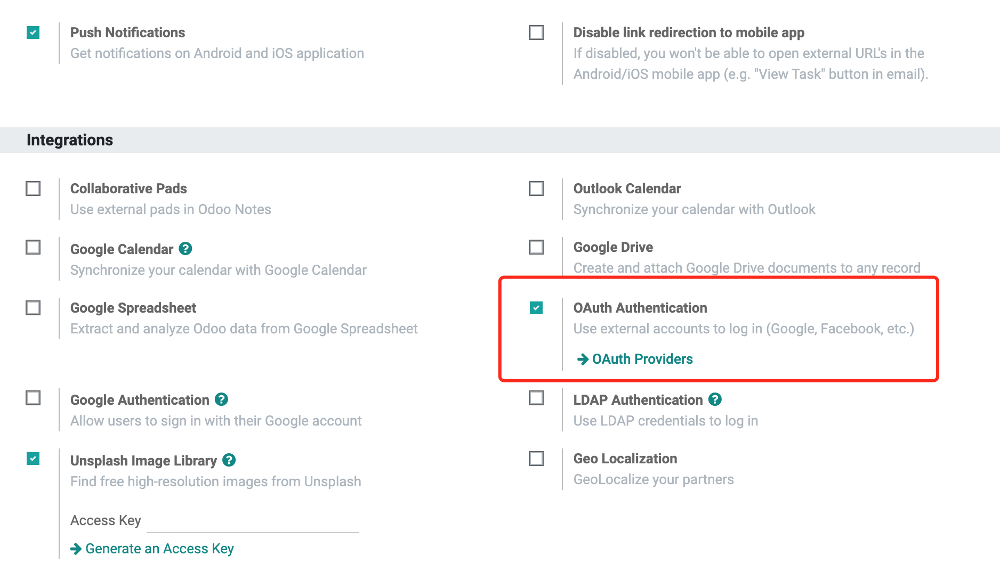
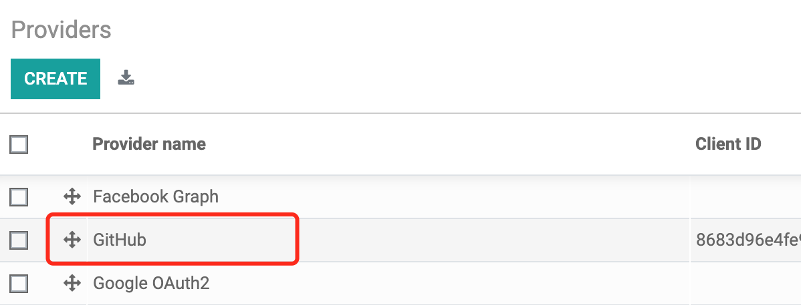
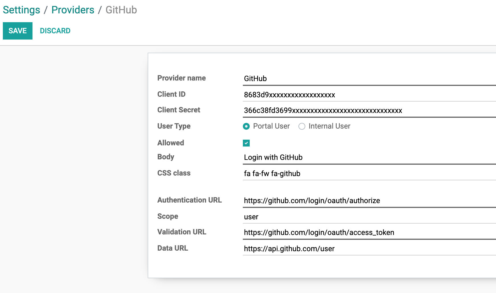
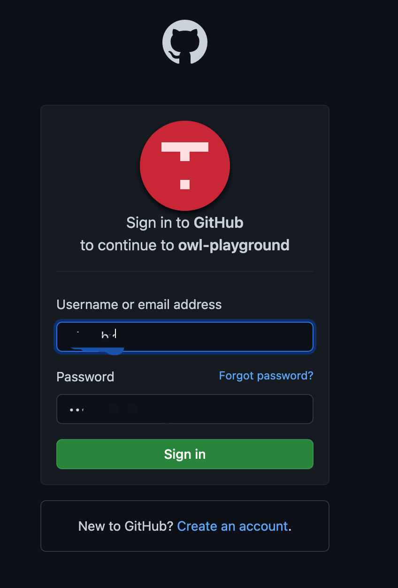
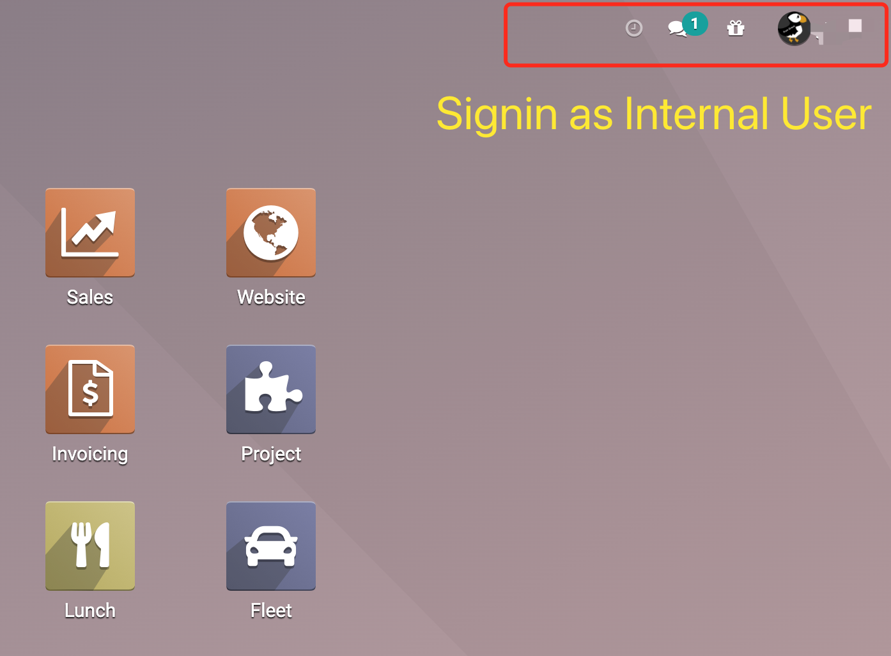
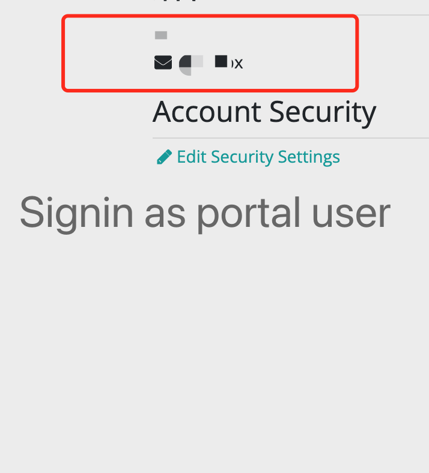

Odoo Github Authentication
===================

Integrate Github Authenticator with Odoo.  

1. Go to Settings -> General Settings -> Integrations. Enabled "OAuth Authentication".  

2. Click OAuth Providers, Select Github item.  

3. Input Client ID and Client Secret.  

4. Save and Goto login page.  

5. Signin with Github account.  

6. Signin as internal user.  

7. Signin as portal user.  
